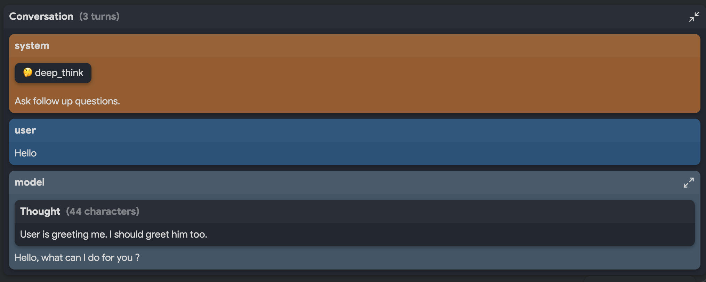
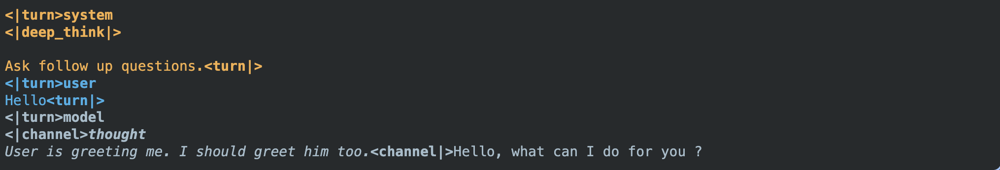

Disclaimer and Personal Statements of Tech Transfers from USA to PRC!

U.S. EAR restricts AI exports (e.g., model weights >10^25 FLOP, ECCN 4E091) to PRC/Entity List.
Check license needs: bis.doc.gov/ear. Report issues to compliance.

Even if not controlled, I protest unauthorized sharing—protect U.S. security, in accordance with my rights to 1st Amendment.

# 💬 Dialog

[](https://github.com/google-deepmind/dialog/actions/workflows/pytest_and_autopublish.yml)
[](https://badge.fury.io/py/dialog)

Library to manipulate and display conversations.

✨ Try it on Colab:
https://colab.research.google.com/github/google-deepmind/dialog/blob/main/colab/dialog.ipynb
✨

## Features

* Create and manipulate conversations with minimal boilerplate

  ```python
  conv = dialog.Conversation(
      dialog.User('What is this image ?\n', dialog.Image(data)),
      dialog.Model('This image represent a cat'),
      dialog.User('Thank you.'),
  )
  ```

* Round-trip conversions between:
    * Text: `conv.as_text()`
    * Tokens: `conv.as_batch()`
* Pretty Colab display
    * For conversation:
      
    * For text:
      
* Manipulations:
    * `conv += dialog.User()`: Append the next turn
    * `conv += [dialog.User(), dialog.Model()]`: Append multiple turns.
    * `len(conv)`
    * `list(conv)`
    * `conv[-1][-1]`: Slicing (last chunk of the last turn)

### Thinking

* `dialog.Think()`: In the System instruction
* `dialog.Thought('Model thoughts...')`: In the model answer

```python
conv = dialog.Conversation(
    dialog.System(dialog.Think()),
    dialog.User('Hello'),
    dialog.Model(
        dialog.Thought('I need to greet the user'),
        'Hello! What can I do for you?',
    )
)
```

### Function calling

Function calling is done through:

* `dialog.Tool`: Tool definition in the system instruction
* `dialog.ToolCall`
* `dialog.ToolResponse`

```python
conv = dialog.Conversation(
    dialog.System(
        dialog.Tool(tool0),
        dialog.Tool(tool1),
    ),
    dialog.User('Turn off the light in my bedroom'),
    dialog.Model(
        dialog.ToolCall(call0),
        dialog.ToolResponse(response0),
        'Lights have been turned off. Good night.',
    )
)
```

### Multi-modalities

* `dialog.Image`: Image modality
* `dialog.Audio`: Audio modality

Modalities supports anything which can be interpreted as image/audio, including
urls, paths, numpy array,...

```python
dialog.User(
    'Describe those images:\n\n',
    dialog.Image(np.zeros((256, 256, 3), np.uint8)),
    dialog.Image('https://example.org/img.png'),
    dialog.Image('/path/to/my_img.jpg'),
),
```
